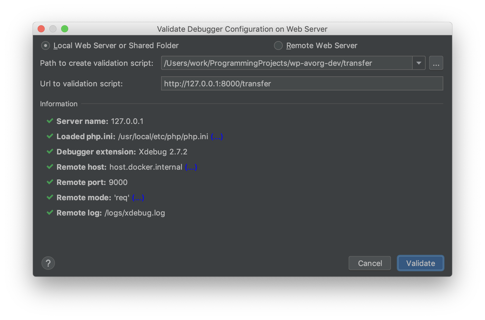

# wp-avorg-dev

## Installation

Install Docker, then:

```bash
chmod +x *.sh
docker-compose up
./setup.sh
open http://localhost:8000
```

## Usage

```bash
docker-compose up
open http://localhost:8000
```

[Home](http://localhost:8000)

[Admin login](http://localhost:8000/wp-login.php)

## Compiling Stylesheet

```bash
npm install -g sass
sass wp-avorg-plugin/style/style.scss wp-avorg-plugin/style/style.css
```

If you use an IDE like PhpStorm you can set up a file watcher to do this automatically.

[More information](http://sass-lang.com/install)

## Commands

### Host Commands

Command                                                                           | Description
----------------------------------------------------------------------------------|------------------------------------
`docker exec wp-avorg-dev_wordpress_1 /bin/bash -c 'cd /usr/src/wordpress && ls'` | Run command from outside container
`docker exec -it wp-avorg-dev_wordpress_1 bash`                                   | Jump into machine

### Any Docker Machine Commands

Command              | Description
---------------------|-------------------------------------
`prentenv`           | See all env vars, including Docker's
`ctrl+p+q` or `exit` | Jump out of machine

### WordPress Docker Machine Commands

Command          | Description
-----------------|----------------
`wp plugin list` | List plugins

## SSL

Certificate generated using [SelfSignedCertificate.com](http://www.selfsignedcertificate.com/) and renamed according to 
[jwilder/nginx-proxy](https://github.com/jwilder/nginx-proxy) readme file.

## Configuring Xdebug

Disable the following options in preferences:

- Force break at first line when no path mapping specified
- Force break at first line when a script is outside the project

[Validate your installation of Xdebug](https://www.jetbrains.com/help/phpstorm/configuring-xdebug.html#web-server-debugging). 
You should see something like this:



In `Preferences > Languages & Frameworks > PHP > Servers`, turn on the following setting for `localhost`:

> Use path mappings (select if the server is remote or symlinks are used)

Then set the server path for `wp-avorg-dev/wp-avorg-plugin` to the following path:

> /var/www/html/wp-content/plugins/wp-avorg-plugin

Install the [Xdebug helper](https://chrome.google.com/webstore/detail/xdebug-helper/eadndfjplgieldjbigjakmdgkmoaaaoc)
Chrome extension, enable debug mode, and tell PhpStorm to start listening for connections. Then you're ready to start
adding breakpoints and debugging your code.
